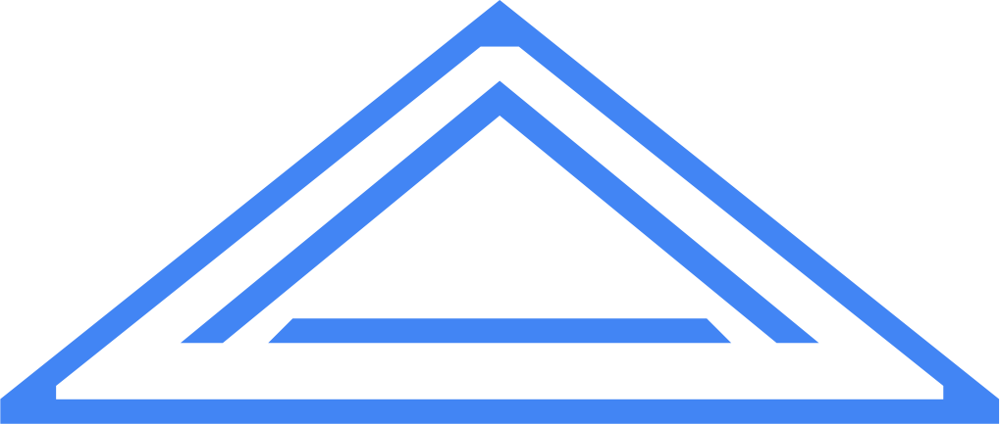
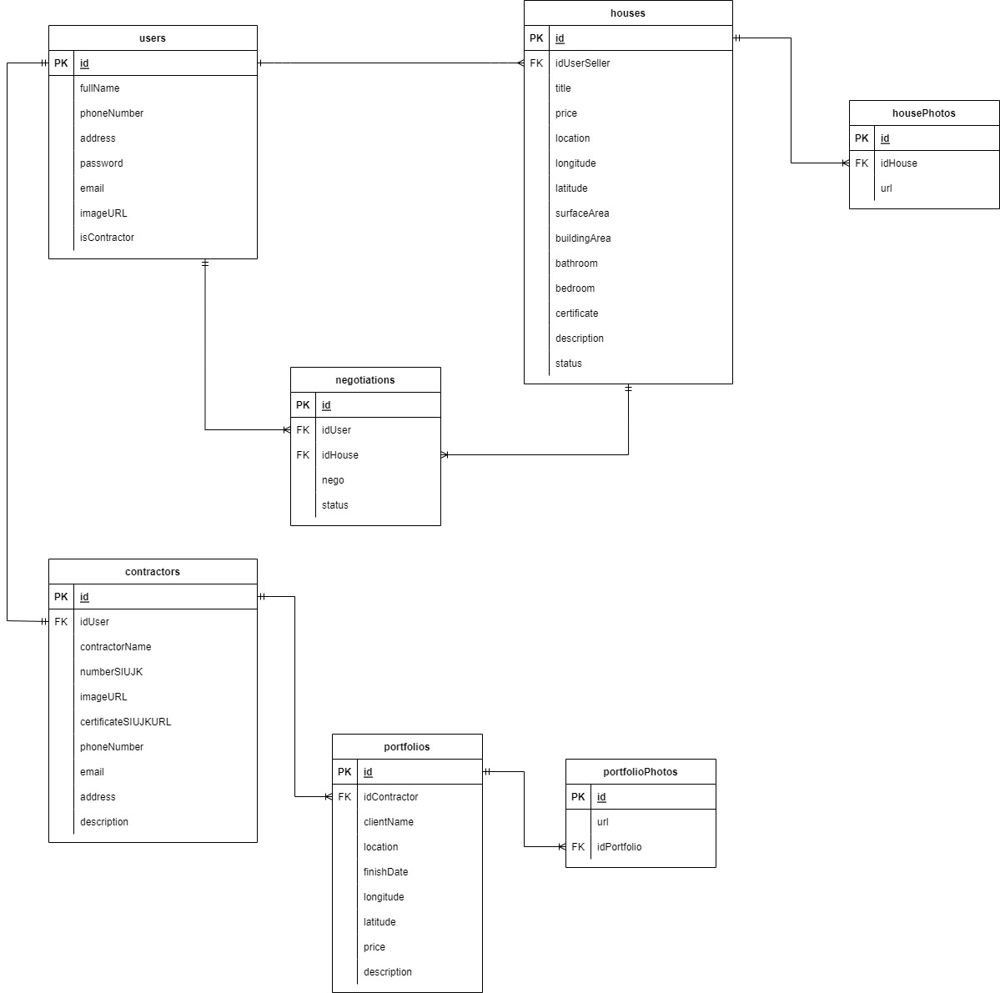

# HOUSE FANCY

<!-- PROJECT LOGO -->
 

  <h3 align="center">Project-Capstone "House Fancy" </h3>

  

    Project Capstone Pembangunan RESTful API Program Immersive Back End Batch 9
     
    <a href="https://github.com/Group1-House-Fancy/GROUP1-BE"><strong>Kunjungi kami »</strong></a>
     
  

<!-- ABOUT THE PROJECT -->
### 💻 &nbsp;About The Project

House Fancy merupakan project capstone untuk membangun sebuah RESTful API dengan menggunakan bahasa Golang.    
Dilengkapi dengan berbagai fitur yang memungkinkan user untuk mengakses data yang ada didalam server, mulai dari membuat akun hingga melakukan jual dan beli rumah. 
Adapun fitur yang ada dalam RESTful API kami antara lain :

      

🙎 User

  
  <!---
  | Command | Description |
| --- | --- |
  --->
  
 User dapat membuat akun dan login, agar mendapat legalitas untuk mengakses berbagai fitur lain di aplikasi ini. 
 Terdapat juga fitur update untuk mengedit data yang berkaitan dengan user, serta fitur delete jika user menginginkan akunnya dihapus.
 

  
| Feature User | Endpoint | Param | JWT Token | Fungsi |
| --- | --- | --- | --- | --- |
| POST | /users  | - | NO | Melakukan proses registrasi user |
| POST | /login | - | NO | Melakukan proses login user |
| GET | /users | - | YES | Mendapatkan informasi akun user yang sedang login |
| PUT | /users | - | YES | Melakukan update informasi akun user yang sedang login | 
| DEL | /users | - | YES | Melakukan delete akun user yang sedang login |

🏠 &nbsp;House

  
  <!---
  | Command | Description |
| --- | --- |
  --->
House merupakan fitur dimana user dapat melakukan penjualan rumah yang dimilikinya serta dapat melakukan update dan delete terhadap rumah yang dimilikinya. User juga dapat melihat daftar rumah dan detail rumah yang dijual.

| Feature House | Endpoint | Param | JWT Token | Fungsi |
| --- | --- | --- | --- | --- |
| POST | /houses | - | YES | Menambahkan rumah yang akan dijual oleh user |
| GET | /houses | - | NO | Menampilkan daftar rumah yang dijual di platform ini |
| GET | /houses/:idHouse | idHouse | NO | Menampilkan detail rumah yang dijual |
| PUT | /houses/:idHouse | idHouse | YES | Melakukan update data rumah yang dijual oleh user |
| DELETE | /houses/:idHouse | idHouse | YES | Melakukan delete rumah yang dijual oleh user |
| POST | /houses/images/:idHouse | idHouse | YES | Menambahkan photo rumah yang dijual oleh user |
| DELETE | /houses/images/:idImage | idImage | YES | Melakukan delete photo rumah yang dijual oleh user |
| GET | /houses/mylisthouses | - | YES | Menampilkan daftar rumah yang dijual oleh user itu sendiri |
| GET | /houses/searches | - | NO | Melakukan pencarian rumah yang dicari oleh user |

🤝 &nbsp;Negotiation

  
  <!---
  | Command | Description |
| --- | --- |
  --->
Negotiation merupakan fitur dimana user dapat melakukan negosiasi pada rumah yang dijual. User juga dapat melihat daftar rumah yang pernah dia nego. User yang melakukan penjualan dapat melakukan update pada negosiasi yang sedang berlangsung.

| Feature Negotiation | Endpoint | Param | JWT Token | Fungsi |
| --- | --- | --- | --- | --- |
| GET | /negotiations | - | YES | Menampilkan history rumah mana saja yang pernah dinego oleh user |
| POST | /negotiations/:idHouse | idHouse | YES | Menambahkan negosiasi pada rumah yang diminati |
| GET | /negotiations/:idHouse | idHouse | YES | Menampilkan daftar user yang melakukan negosiasi pada satu rumah |
| DELETE | /negotiations/:idNegotiation | idNegotiation | YES | Melakukan delete negosiasi |
| PUT | /negotiations/:idNegotiation | idNegotiation | YES | Melakukan update negosiasi |

👷 &nbsp;Contractor

  
  <!---
  | Command | Description |
| --- | --- |
  --->
Contractor merupakan fitur dimana user dapat join sebagai kontraktor serta melakukan update data kontraktor dan delete akun kontraktor.

| Feature Contractor | Endpoint | Param | JWT Token | Fungsi |
| --- | --- | --- | --- | --- |
| POST | /contractors | - | YES | Melakukan join sebagai kontraktor |
| GET | /contractors | - | NO | Menampilkan daftar kontraktor yang ada di platform ini |
| DELETE | /contractors | - | YES | Melakukan delete akun kontraktor |
| GET | /contractors/:idContractor | idContractor | NO | Menampilkan detail kontraktor |
| PUT | /contractors/:idContractor | idContractor | YES | Melakukan update akun kontraktor |

💼 &nbsp;Portfolio

  
  <!---
  | Command | Description |
| --- | --- |
  --->
Portfolio merupakan fitur dimana kontraktor dapat menambahkan portofolio serta melakukan update dan delete dari portofolio yang dibuat.

| Feature comment | Endpoint | Param | JWT Token | Fungsi |
| --- | --- | --- | --- | --- |
| POST | /portfolios | - | YES | Menambahkan portofolio pada kontraktor |
| GET | /portfolios/contractors/:idContractor | idContractor | NO | Menampilkan daftar portofolio yang dimiliki oleh kontraktor |
| GET | /portfolios/details/:idPortfolio | idPortfolio  | YES | Menampilkan detail portofolio yang dimiliki oleh kontraktor |
| PUT | /portfolios/details/:idPortfolio | idPortfolio  | YES | Melakukan update data portofolio |
| DELETE | /portfolios/details/:idPortfolio | idPortfolio  | YES | Melakukan delete portofolio |
| POST | /portfolios/images/:idPortfolio | idPortfolio | YES | Menambahkan photo pada portofolio |
| DELETE | /portfolios/images/:idImage | idImage | YES | Melakukan delete photo pada portofolio |

### Swagger
<a href="https://app.swaggerhub.com/apis-docs/faizalsundara/Kelompok1/1.0.0#/"><strong> Link »</strong></a>

<!-- IMAGES -->
### 🖼&nbsp;Images

📈&nbsp;ERD

<!-- CONTACT -->
### Contact

:copyright: 2022 | Faizal Tyas

</h3>